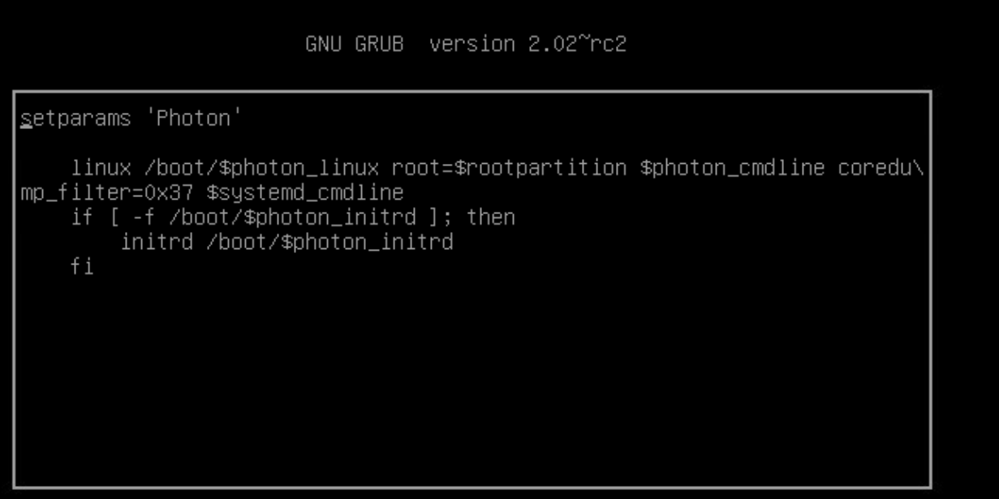
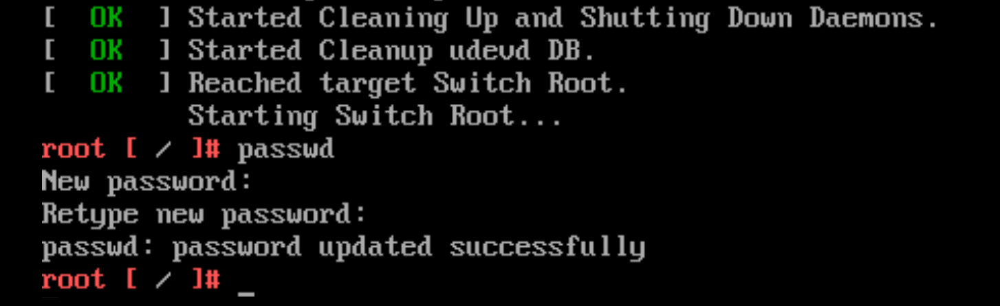

# reset-root-password-uag
1. Log into vcenter console.
2. Locate the airwatch uag vm or appliance and connect vm console.
3. Restart the uag vm.
4. When bootup or appeart photon OS GUI page press "**e**".
5. Then, You will see the below GRUB options.
    * GNU GRUB




6. Remove all the word after "**root=$rootpartition**" and add below line after it.
    ```
    rw init=/bin/bash
    ```
    * Full line will be look like below
    ```
    linux /boot/$photon_linux root=$rootpartition rw init=/bin/bash
    ```
7. Type Ctrl+X or F10 to load after that it'll boot to root shell.

    * PASSWD shell
    

        ```
        passwd
        ```
    * Type new password and confrim new password.

8. This step is depedend on your requirements, you can do this step if your account is locked.

    * Check your account is lock or not.

        ```
        pam_tally2 -u root
        ```
    * If result shown 2 or more in failures coloum, excute below command and then check again above command failures value will be "0".
        ```
        pam_tally2 -u root -r
        ```


Ref url: [vmware](https://docs.vmware.com/en/Unified-Access-Gateway/3.8/com.vmware.uag-38-deploy-config.doc/GUID-F1B90F5A-DC1A-4175-B345-A4984F9AF757.html),[minarik.io](https://minarik.io/unified-access-gateway-password-resets/)